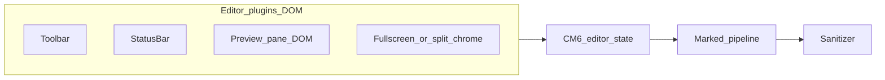
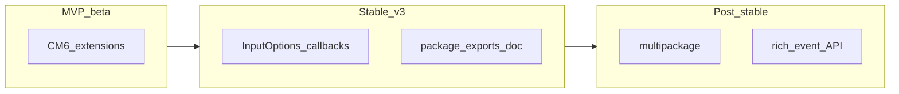

# Plugins and extensions (1.0)

Normative specification for how EasyMDE V3 exposes three extension surfaces: **Editor plugins** (DOM lifecycle), **CodeMirror 6 extensions** (editing behaviour), and the **Marked** pipeline (Markdown → HTML for preview). Implementation must **dogfood** these APIs: built-in features use the same contracts as third-party code.

**Related:** [overview.md](overview.md), [decisions.md](decisions.md) (§2 sanitization, §6 plugin interface, §8 exports), [milestone-a-foundations.md](milestone-a-foundations.md) (A3, A5), [milestone-c-layout.md](milestone-c-layout.md), [milestone-e-post-stable.md](milestone-e-post-stable.md) (future bundled plugins), **§7** [Events & hooks](#7-events--hooks-issue-447) ([issue #447](https://github.com/Ionaru/easy-markdown-editor/issues/447)).

---

## 1. Mental model

Editing happens in **CodeMirror 6**. Preview and side-by-side HTML come from **Marked** (or a consumer override), then **sanitization**. **Editor plugins** attach UI chrome (toolbar, status bar, preview pane shell, fullscreen/split wrappers) around that core—they do not replace CM6 or Marked unless they explicitly call APIs that do.



**When to use which:**

| Need                                                                | Surface                                                             |
| ------------------------------------------------------------------- | ------------------------------------------------------------------- |
| Change editing behaviour, shortcuts, decorations, gutters           | CodeMirror 6 `Extension`s                                           |
| Change HTML output dialect, tokenizer, custom Markdown syntax       | Marked pipeline (`MarkedOptions`, extensions—see §4), then sanitize |
| Add panels, overlays, toolbar rows, mounts tied to editor lifecycle | Editor plugins (`IEasyMDEPlugin`)                                   |

---

## 2. Editor plugins (`IEasyMDEPlugin`)

### 2.1 Interface (normative)

The public shape is defined in [decisions.md](decisions.md) §6. **Normative interface:**

```ts
export interface IEasyMDEPlugin {
    readonly element: HTMLElement;
    mount(): void;
    unmount(): void;
}
```

Semantics:

- **`element`** — Root DOM node owned by the plugin (built before `mount`).
- **`mount()`** — Attaches `element` into the EasyMDE layout at the documented position (see below).
- **`unmount()`** — Removes `element` from the document and drops listeners; idempotent-safe if called once.

Synchrony: `mount` and `unmount` are synchronous unless a future semver-minor explicitly documents otherwise.

Legacy note: Implementations predating this spec may still expose `build`/`destroy`; new code MUST use `mount`/`unmount` once [milestone-a-foundations.md](milestone-a-foundations.md) A3 lands.

### 2.2 Registration and lifecycle

- **`EasyMDE.addPlugin(plugin)`** pushes the plugin, then calls **`plugin.mount()`** immediately (same tick as registration).

- **Destructor name:** **`EasyMDE.destruct()`** is the canonical public teardown method.

- **Destruction:** For each registered **`IEasyMDEPlugin`**, **`destruct()`** calls **`plugin.unmount()`** in **reverse registration order** (last added, first torn down)—symmetric stack discipline.

**DOM insert order** inside `.easymde-container`:

1. Toolbar (when enabled — **`IEasyMDEPlugin`**)
2. CodeMirror editor root (`EditorView` holder created by **`EasyMDE`**)
3. Preview pane (**`Preview`** from [milestone-a-foundations.md](milestone-a-foundations.md) A5 — **`IEasyMDEPlugin`**; sibling of CM; visibility from CSS unless side-by-side)
4. Status bar (when enabled — **`IEasyMDEPlugin`**)
5. **Custom plugins** (**not** Toolbar / Preview / StatusBar) registered via **`addPlugin`**, in registration order

Implementations MAY wrap nodes 2–3 in an inner wrapper for CSS grid (side-by-side). **Fullscreen**/**side-by-side** are **modes** on **`.easymde-container`** (+ inner layout CSS per [milestone-c-layout.md](milestone-c-layout.md)); no extra unexplained DOM subtree unless an optional shell refactor is intentionally dogfooded **and** justified here.

**Late registration (`addPlugin` after `EasyMDE.construct()` completes):** **unsupported** for **`v3.0.x`**. Embedders MUST pass built-in knobs via **`InputOptions`** (or **`codemirrorExtensions`**). Revisit only in a MINOR that explicitly permits it—until then callers MUST NOT rely on deferred registration.

### 2.3 Dogfooding (1.0)

Built-in **Toolbar**, **StatusBar**, and **Preview** MUST implement **`IEasyMDEPlugin`**. Layout modes (**fullscreen**, **side-by-side**) SHOULD be implemented via container CSS + methods on **`EasyMDE`** alone; introducing a standalone **fullscreen/split-shell** plugin MUST still dogfood **`IEasyMDEPlugin`** **and** be documented above in §**2.2**.

---

## 3. CodeMirror 6 extensions

### 3.1 Consumer-facing API (1.0 target)

Consumers pass additional CodeMirror extensions via options (exact field name ships with implementation; placeholder: **`codemirrorExtensions?: Extension`**). Values follow CodeMirror rules: **`Extension`** may be nested arrays and flattens ([reference](https://codemirror.net/docs/ref/)).

EasyMDE composes extensions in **deterministic order**:

1. **EasyMDE base stack** (document model, Markdown language mode, wrapping, selection drawing, bundled highlight styles, undo/history when added, **default keymap**, etc.)
2. **Consumer `codemirrorExtensions`** — appended unless a future option documents `prepend*` for advanced cases.

Breaking changes (e.g. reordering defaults) follow semver MAJOR guidelines in §5.

### 3.2 Upstream patterns (authors)

Authors may follow idioms documented by CodeMirror:

- **Composable helpers** returning **`Extension`** (see [zebra stripes example](https://codemirror.net/examples/zebra/) — `Facet.define({ combine })`, `EditorView.baseTheme`, `ViewPlugin.fromClass`).
- **`EditorView.baseTheme`** for theme-aware styling (`&light` / `&dark`) so extensions respect [milestone-c-layout.md](milestone-c-layout.md) / theming.
- **`Compartment` + `StateEffect.reconfigure`** ([ref](https://codemirror.net/docs/ref/)) for swapping extension subsets without recreating the editor—optional for 1.0 consumers; EasyMDE may use internally for preview/layout toggles.

### 3.3 Dogfooding

Internal defaults (history, keymap, heading highlight styles, etc.) MUST be assembled with the **same merge helper** used for option-driven extensions (conceptually: `buildEasyMDEExtensions(resolvedOptions) + userExtensions`). No second hard-coded `EditorState.create` path for “internal only” features.

---

## 4. Marked pipeline

### 4.1 Single pipeline

All Markdown → HTML paths for **preview**, **side-by-side**, and any other built-in HTML preview MUST call one internal **render pipeline** so options apply consistently.

### 4.2 Marked API policy (1.0)

**Problem:** The global `marked` export accumulates `marked.use()` calls. Marked’s docs warn that calling **`marked.use` repeatedly** in per-mount code (e.g. framework components) can stack extensions and cause **recursion errors**; they recommend a **`Marked` instance** when registration cannot run once at module scope ([Using Pro — `marked.use`](https://marked.js.org/using_pro)).

**Normative policy for EasyMDE:**

1. **Parser instance:** EasyMDE MUST use a **dedicated `Marked` instance per editor instance** (or equivalent isolation) for applying **MarkedOptions** and internal defaults. The **global** `marked` MUST NOT be mutated by construction or instance options unless explicitly documented as an advanced escape hatch.
2. **Consumer configuration (supported in 1.0):**
    - **`renderingConfig.markedOptions`** — [`MarkedOptions`](https://marked.js.org/using_pro) merged into the per-instance parser according to Marked’s option merge rules.
    - **`renderingConfig.sanitizerFunction`** — applied to HTML **after** Markdown render and **after** any `previewRender` return (see below). Aligns with [decisions.md](decisions.md) §2 (DOMPurify peer / safe default).
    - **`previewRender(markdown, previewElement)`** — when provided, replaces the default Marked path for that call site: consumer returns HTML string; **sanitizer still runs** on the returned string unless a future option explicitly opts out (not defined in 1.0).

3. **Not required for 1.0 public API:** arbitrary `marked.use` of **custom tokenizer extensions** from consumer code. If exposed later, it MUST go through the isolated instance, not the global singleton.

**Field names on `InputOptions` / `Options`:** `previewRender`, `renderingConfig.markedOptions`, and `renderingConfig.sanitizerFunction` live alongside all other resolved keys enumerated in [milestone-a-foundations.md](milestone-a-foundations.md) **A1** (implementations SHOULD keep this list and §4 aligned).

### 4.3 Terminology (Marked docs)

- **MarkedExtension** — object passed to `marked.use({ ... })` on the **instance**: options, `hooks`, `renderer` / `tokenizer` overrides, and `extensions: [...]` for custom syntax ([Using Pro](https://marked.js.org/using_pro)).
- **Merge behaviour:** Plain options overwrite; **`renderer`, `tokenizer`, `hooks`, `walkTokens`, `extensions`** **merge**. Multiple `walkTokens` / `hooks` run in an order that starts with the **last registered** function—EasyMDE MUST document how its defaults merge **before** user `markedOptions` if it injects hooks.

### 4.4 Sanitization story

Two layers appear in the ecosystem:

- Marked **hooks `postprocess`** with DOMPurify ([official example](https://marked.js.org/using_pro)).
- EasyMDE **`renderingConfig.sanitizerFunction`** / DOMPurify per [decisions.md](decisions.md) §2.

**Normative rule:** EasyMDE applies **one** sanitization step at the end of the pipeline (implementation may use `hooks.postprocess` internally or a string function—transparent to the consumer). Consumers MUST NOT need to choose between duplicate incompatible hooks if they set **`renderingConfig.sanitizerFunction`**.

### 4.5 `previewRender` vs Marked

If **`previewRender`** is set, it **replaces** default Marked rendering for that preview invocation. **Preprocessing** (e.g. front-matter) is only applied if the implementation explicitly runs it or documents otherwise. **Sanitization** applies to the returned HTML string.

### 4.6 Dogfooding

Built-in preview MUST call the same **`renderMarkdownToHtmlForPreview(...)`** (name illustrative) used by public options—no duplicate `marked.parse` with different defaults in another module.

---

## 5. Compatibility and versioning

| Surface                         | Semver guidance                                                                                                                    |
| ------------------------------- | ---------------------------------------------------------------------------------------------------------------------------------- |
| **Editor `IEasyMDEPlugin`**     | Adding optional methods or widening mount behaviour: MINOR. Renaming or changing mount order contract: MAJOR.                      |
| **CM6 default extension order** | Reordering EasyMDE’s base stack can break consumer extensions that rely on precedence: treat as **MAJOR** or document mitigations. |
| **Marked**                      | Dependency major bumps (Marked’s API) require EasyMDE release notes and possible MAJOR if defaults change.                         |
| **Options**                     | New optional fields: MINOR. Renaming or removing fields: MAJOR.                                                                    |

---

## 6. Examples (illustrative)

### 6.1 Editor plugin skeleton

```ts
class HelloPlugin implements IEasyMDEPlugin {
    readonly element = document.createElement("aside");

    constructor() {
        this.element.className = "easymde-hello-plugin";
        this.element.textContent = "Hello";
    }

    mount(): void {
        /* easyMDE.container.appendChild(this.element) — performed by EasyMDE in real impl */
    }

    unmount(): void {
        this.element.remove();
    }
}
```

### 6.2 CodeMirror: extra keymap snippet

```ts
import { keymap } from "@codemirror/view";
import { Extension } from "@codemirror/state";

const bang: Extension = keymap.of([{ key: "Ctrl-b", run: () => true }]);
// Pass `bang` via future `codemirrorExtensions` option.
```

### 6.3 Marked options + sanitization

Consumer sets `renderingConfig: { markedOptions: { gfm: true }, sanitizerFunction: (html) => ... }`. EasyMDE applies these through the **per-instance** parser (§4.2)—not `import { marked } from 'marked'` global mutation.

---

## 7. Events & hooks (issue #447)

[Issue #447](https://github.com/Ionaru/easy-markdown-editor/issues/447) calls for **easier event hooks** than V2. This section splits that goal by release phase (see [overview.md — Release phases](overview.md#release-phases)).

### 7.1 MVP / always — CodeMirror as the hook layer

- **`codemirrorExtensions`** (§3): consumers attach **`EditorView.updateListener`**, keymaps, and other CM6 extensions for low-level document/view notifications.
- This is the **baseline** hook surface for beta: no separate EasyMDE event bus is required to ship MVP.

### 7.2 Stable (`v3.0.0`) — narrow `InputOptions` callbacks

Add a **small, typed** set of optional callbacks on `InputOptions` / `Options` (exact names and payloads ship with implementation), for example:

| Callback (illustrative name) | When it runs                                                                                           |
| ---------------------------- | ------------------------------------------------------------------------------------------------------ |
| `onDocumentChange`           | After the editor document changed and the transaction committed (debouncing policy documented if any). |
| `onPreviewToggle`            | When preview mode is turned on or off.                                                                 |
| `onLayoutModeChange`         | When side-by-side or fullscreen enters or exits (payload: which mode, boolean active).                 |

Rules:

- Callbacks MUST NOT throw into EasyMDE internals; errors are the consumer’s responsibility.
- Callbacks are **single-function** options (not multi-subscriber). Multiple listeners are out of scope for Stable—use CM6 listeners or small wrappers.

Document every callback in the README options table ([milestone-d-quality.md](milestone-d-quality.md) D4).

### 7.3 Post-stable — extended event API

Reserved for a richer model if needed:

- **Multi-subscriber** APIs, **EventTarget-style** dispatch, or **ordering guarantees** across listeners.
- **Optional multipackage** ergonomics may influence packaging (`easymde-core` vs full); see [overview.md](overview.md) Post-1.0 rows.

No normative design until demand is proven — avoid speculative surface area before `v3.0.0`.



---

## 8. Appendix A — Dogfooding matrix (1.0 roadmap)

Built-in surfaces MUST use the APIs in this table once the listed milestone lands. **TBD** indicates spec ahead of implementation.

| Feature                       | Editor plugin                                                                   | CM6 extensions                  | Marked / sanitize        | Milestone                                                    |
| ----------------------------- | ------------------------------------------------------------------------------- | ------------------------------- | ------------------------ | ------------------------------------------------------------ |
| Default toolbar               | Yes                                                                             | Toolbar actions use editor APIs | No                       | [A](milestone-a-foundations.md), [B](milestone-b-toolbar.md) |
| Status bar                    | Yes                                                                             | Reads doc/state via `EasyMDE`   | No                       | [A](milestone-a-foundations.md)                              |
| Preview pane (DOM shell)      | Yes                                                                             | —                               | Uses shared pipeline     | [A](milestone-a-foundations.md) A5                           |
| Default keymap / undo         | Via merge helper (`§3.3`)                                                       | Yes                             | No                       | [A](milestone-a-foundations.md), [B](milestone-b-toolbar.md) |
| Side-by-side layout           | Uses **Preview** + container/grid CSS (`§2.2`; no separate unexplained subtree) | —                               | Same pipeline as preview | [C](milestone-c-layout.md)                                   |
| Fullscreen layout             | Container **`EasyMDE` mode** + CSS (`§2.2`); optional trap via CM helpers       | Possible focus helpers          | No                       | [C](milestone-c-layout.md)                                   |
| Syntax highlighting in editor | —                                                                               | Included in base stack          | No                       | Current + [A](milestone-a-foundations.md)                    |
| Form sync / `value()`         | —                                                                               | CM `doc`                        | No                       | [A](milestone-a-foundations.md) A6–A7                        |
| Web component wrapper         | Embeds `EasyMDE`                                                                | Same as instance                | Same as instance         | [A](milestone-a-foundations.md) A8                           |

---

## 9. Appendix B — Future bundled plugins (post-1.0)

**Autosave** and **image upload** ([milestone-e-post-stable.md](milestone-e-post-stable.md)) SHOULD be implemented as **Editor plugins** (and optional CM6 listeners for paste/drop) on top of the same public surfaces. They are **not** required for 1.0 scope per [overview.md](overview.md).

---

## 10. Derived documentation

User-facing **README** and demo should summarize the three surfaces and link to this spec; full prose is tracked under [milestone-d-quality.md](milestone-d-quality.md).

---

## References

- [Marked — Using Pro / Extending Marked](https://marked.js.org/using_pro)
- [CodeMirror reference manual](https://codemirror.net/docs/ref/)
- [CodeMirror example: Zebra stripes](https://codemirror.net/examples/zebra/)
